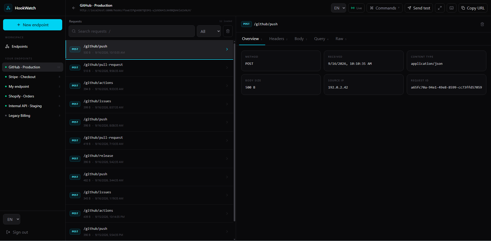
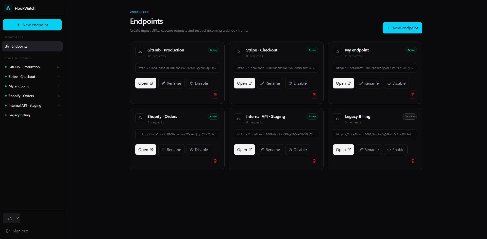
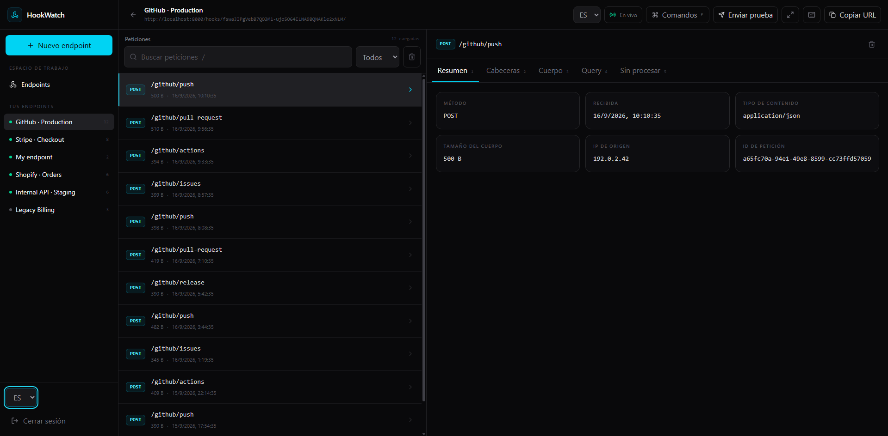
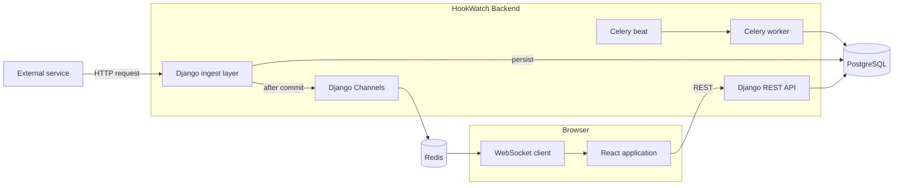
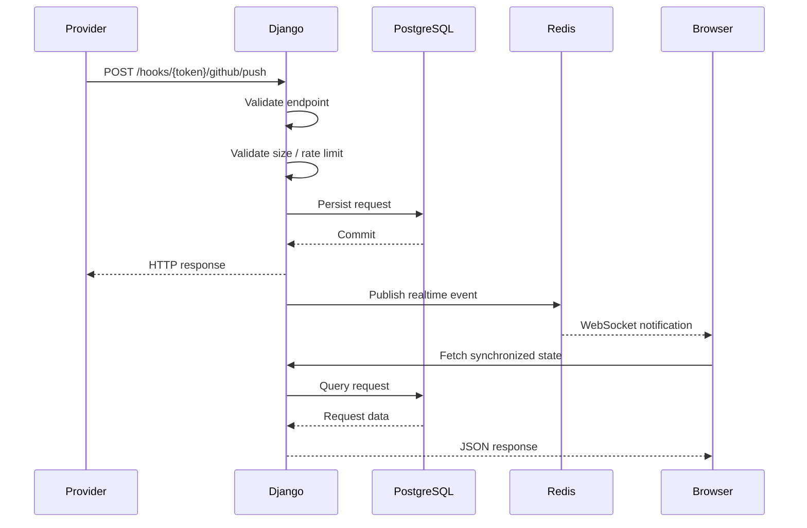

<div align="center">

# HookWatch

### Real-time webhook inspection for developers

Capture, inspect and debug HTTP webhooks as they arrive.

<br />

<p>
  
  
  
  
  
  
  
</p>

<p>
  <a href="https://github.com/blesa03/HookWatch/actions/workflows/ci.yml">
    
  </a>
  
</p>

<br />



</div>

---

## What is HookWatch?

**HookWatch** is a full-stack developer tool for receiving, inspecting and debugging webhooks and arbitrary HTTP requests in real time.

Instead of adding temporary logging to an application or trying to reproduce requests manually, HookWatch generates an ingest URL that can be configured directly in services such as GitHub, Stripe, Shopify or an internal API.

When a request arrives, HookWatch:

```text
receives it
   ↓
persists it
   ↓
notifies the browser in real time
   ↓
lets you inspect the complete request
```

The application stores the captured request in PostgreSQL before realtime notifications are emitted, keeping the database as the authoritative source of truth.

---

<div align="center">

## Screenshots

### Endpoint dashboard



<br />
<br />

### Webhook inspector


<br />
<br />

### Spanish interface



</div>

---

## Features

<table>
<tr>
<td width="50%" valign="top">

### Capture

- Generated webhook ingest URLs
- Common HTTP methods
- Nested webhook paths
- Raw request body
- Parsed JSON payloads
- Headers
- Query parameters
- Content type
- Source IP
- Request size
- Receive timestamp

</td>
<td width="50%" valign="top">

### Inspection

- Realtime request updates
- Overview inspector
- Headers inspector
- JSON body viewer
- Raw body viewer
- Query inspector
- Search
- HTTP method filters
- Cursor pagination
- Request deletion
- Complete history clearing

</td>
</tr>

<tr>
<td width="50%" valign="top">

### Workflow

- Built-in HTTP test sender
- Command palette
- Keyboard navigation
- Focus mode
- Responsive interface
- English / Spanish UI
- Persistent language preference

</td>
<td width="50%" valign="top">

### Platform

- Anonymous temporary endpoints
- Registered persistent endpoints
- Anonymous endpoint adoption
- JWT authentication
- HttpOnly refresh cookies
- WebSocket ticket authentication
- Rate limiting
- Health checks
- Automatic temporary cleanup

</td>
</tr>
</table>

---

## Anonymous mode

HookWatch can be used without creating an account.

From the landing page, a temporary endpoint can be created immediately.

Temporary endpoints:

- expire after **24 hours**
- can capture and inspect real requests
- use a management token separate from the public ingest token
- can be converted into permanent endpoints by registering

When registration happens from the same browser session, HookWatch adopts the temporary endpoint and preserves its captured request history.

---

## Architecture



### Core principle

> **PostgreSQL is the source of truth. WebSockets are a UX enhancement.**

Realtime messages tell the browser that something changed.

They do not replace persisted state.

If a WebSocket disconnects or the browser misses an event, the client can recover the authoritative state through the REST API.

For a more detailed explanation, see:

**[`docs/ARCHITECTURE.md`](docs/ARCHITECTURE.md)**

---

## Request lifecycle



The ingest path is intentionally kept small.

Persistence happens first. Realtime and other non-critical operations are kept outside the critical database transaction where possible.

---

## Technology stack

<table>
<tr>
<td valign="top">

### Frontend

- React 19
- TypeScript
- Vite
- Tailwind CSS
- React Router
- TanStack Query
- React Hook Form
- Zod
- i18next
- react-i18next
- Lucide React

</td>
<td valign="top">

### Backend

- Python 3.13
- Django 5.2 LTS
- Django REST Framework
- Django Channels
- Daphne
- Simple JWT
- Celery

</td>
<td valign="top">

### Infrastructure

- PostgreSQL
- Redis
- Docker
- Docker Compose
- GitHub Actions

</td>
<td valign="top">

### Testing

- pytest
- pytest-cov
- Ruff
- Vitest
- React Testing Library
- Playwright

</td>
</tr>
</table>

---

## Quick start

### Requirements

You need:

```text
Git
Docker
Docker Compose
```

Clone the project:

```bash
git clone https://github.com/blesa03/HookWatch.git
cd HookWatch
```

Create your environment file.

### Windows PowerShell

```powershell
Copy-Item .env.example .env
```

### Linux / macOS

```bash
cp .env.example .env
```

Start the entire stack:

```bash
docker compose up --build
```

Once the containers are healthy:

<table>
<thead>
<tr>
<th>Service</th>
<th>Address</th>
</tr>
</thead>

<tbody>
<tr>
<td>Frontend</td>
<td><code>http://localhost:5173</code></td>
</tr>

<tr>
<td>REST API</td>
<td><code>http://localhost:8000/api/v1/</code></td>
</tr>

<tr>
<td>Django admin</td>
<td><code>http://localhost:8000/admin/</code></td>
</tr>

<tr>
<td>Liveness</td>
<td><code>http://localhost:8000/api/v1/health/live/</code></td>
</tr>

<tr>
<td>Readiness</td>
<td><code>http://localhost:8000/api/v1/health/ready/</code></td>
</tr>
</tbody>
</table>

Database migrations are automatically applied when the backend container starts.

---

## Using an endpoint

Create an endpoint from the dashboard.

HookWatch generates an ingest URL similar to:

```text
http://localhost:8000/hooks/<ingest-token>/
```

Nested paths are supported:

```text
http://localhost:8000/hooks/<ingest-token>/github/push
```

Send a test request:

```bash
curl -X POST \
  "http://localhost:8000/hooks/<ingest-token>/github/push" \
  -H "Content-Type: application/json" \
  -H "X-Event-Type: push" \
  -d '{
    "repository": "HookWatch",
    "ref": "refs/heads/main",
    "event": "push"
  }'
```

The request will appear in the workspace and can be inspected immediately.

---

## Captured data

Each webhook request can contain:

```text
UUID
Endpoint
HTTP method
Path
Headers
Query parameters
Content-Type
Raw body
Parsed JSON
Body size
Source IP
Timestamp
```

Both the structured JSON representation and original raw body are retained.

This allows HookWatch to display useful structured data without losing the exact request payload.

---

## Authentication

HookWatch uses JWT authentication.

### Access token

The access token is stored only in application memory.

It is not persisted in:

```text
localStorage
sessionStorage
```

### Refresh token

The refresh token is stored in an **HttpOnly cookie** scoped to the authentication API.

The backend handles:

```text
registration
login
refresh
rotation
logout
blacklisting
```

This keeps the long-lived refresh credential unavailable to frontend JavaScript.

---

## Realtime authentication

WebSocket connections do not place a normal long-lived JWT directly in the WebSocket URL.

Instead, HookWatch uses short-lived tickets.

```text
Browser
   ↓
POST /api/v1/ws/tickets/
   ↓
short-lived one-use ticket
   ↓
Redis
   ↓
WS /ws/endpoints/{id}/?ticket=...
```

The ticket is scoped to the target endpoint and expires quickly.

If the socket reconnects, the client obtains a new ticket and resynchronizes state through REST.

---

## API

<details>
<summary><strong>Authentication endpoints</strong></summary>

<br />

| Method | Endpoint | Description |
| --- | --- | --- |
| `POST` | `/api/v1/auth/register/` | Register |
| `POST` | `/api/v1/auth/login/` | Login |
| `POST` | `/api/v1/auth/refresh/` | Refresh access token |
| `POST` | `/api/v1/auth/logout/` | Logout |
| `GET` | `/api/v1/auth/me/` | Current user |

</details>

<details>
<summary><strong>Endpoint management</strong></summary>

<br />

| Method | Endpoint | Description |
| --- | --- | --- |
| `POST` | `/api/v1/anonymous/endpoints/` | Create anonymous endpoint |
| `POST` | `/api/v1/endpoints/adopt/` | Adopt temporary endpoint |
| `GET` | `/api/v1/endpoints/` | List endpoints |
| `POST` | `/api/v1/endpoints/` | Create endpoint |
| `GET` | `/api/v1/endpoints/{id}/` | Endpoint detail |
| `PATCH` | `/api/v1/endpoints/{id}/` | Update endpoint |
| `DELETE` | `/api/v1/endpoints/{id}/` | Delete endpoint |
| `POST` | `/api/v1/endpoints/{id}/test/` | Send test request |

</details>

<details>
<summary><strong>Captured requests</strong></summary>

<br />

| Method | Endpoint | Description |
| --- | --- | --- |
| `GET` | `/api/v1/endpoints/{id}/requests/` | List requests |
| `GET` | `/api/v1/endpoints/{id}/requests/{requestId}/` | Request detail |
| `DELETE` | `/api/v1/endpoints/{id}/requests/{requestId}/` | Delete request |
| `POST` | `/api/v1/endpoints/{id}/requests/clear/` | Clear captured requests |

</details>

<details>
<summary><strong>Realtime</strong></summary>

<br />

| Type | Endpoint | Description |
| --- | --- | --- |
| HTTP `POST` | `/api/v1/ws/tickets/` | Obtain temporary WS ticket |
| WebSocket | `/ws/endpoints/{id}/?ticket=...` | Realtime endpoint events |

</details>

---

## Demo data

HookWatch includes a management command that generates realistic data for development, screenshots and demonstrations.

First create an account through the UI.

Then run:

```bash
docker compose exec backend \
  python manage.py seed_demo_data --email you@example.com
```

The command creates example integrations such as:

```text
GitHub · Production
Stripe · Checkout
Shopify · Orders
Internal API · Staging
Legacy Billing
```

with realistic webhook payloads, headers and timestamps.

Running the command again replaces that user's previous demo endpoints instead of endlessly duplicating them.

---

## Internationalization

HookWatch currently supports:

```text
English
Spanish
```

English is the default language.

The language preference is persisted in the browser and can be changed without reloading the application.

Only the **interface** is translated.

Captured HTTP data is intentionally left untouched:

```text
HTTP methods
header names
URLs
JSON keys
JSON values
webhook event names
raw payloads
endpoint names
```

The inspector therefore always shows the actual data received by HookWatch.

---

## Keyboard shortcuts

| Key | Action |
| --- | --- |
| `P` | Open command palette |
| `F` | Toggle focus mode |
| `/` | Focus request search |
| `J` / `↓` | Next request |
| `K` / `↑` | Previous request |
| `1` | Overview |
| `2` | Headers |
| `3` | Body |
| `4` | Query |
| `5` | Raw |
| `T` | Open test sender |
| `?` | Show shortcuts |
| `Esc` | Close overlay / leave focus mode |

---

## Resilience

HookWatch distinguishes between critical and non-critical infrastructure.

### PostgreSQL

PostgreSQL is critical.

If a webhook cannot be persisted, HookWatch does not pretend that the capture succeeded.

### Redis

Redis powers:

```text
WebSocket events
WebSocket tickets
rate limiting
Celery infrastructure
```

A Redis/realtime failure should not invalidate a webhook request that has already been successfully committed to PostgreSQL wherever the operation can degrade safely.

### WebSockets

WebSocket state is recoverable.

The frontend can resynchronize using the REST API after reconnecting.

---

## Security considerations

HookWatch includes:

- high-entropy ingest tokens
- separate anonymous management credentials
- hashed temporary management tokens
- in-memory access JWTs
- HttpOnly refresh cookies
- refresh-token blacklisting
- short-lived WebSocket tickets
- WebSocket origin validation
- configurable trusted proxies
- source-IP validation
- request body-size limits
- ingest rate limiting
- non-revealing endpoint authorization failures

---

## Health checks

Available endpoints:

```text
GET /api/v1/health/
GET /api/v1/health/live/
GET /api/v1/health/ready/
```

Docker Compose also includes health checks for PostgreSQL and Redis.

---

## Background jobs

Celery is used for work that does not belong on the webhook ingestion critical path.

Celery Beat schedules periodic work.

The current background lifecycle includes automatic cleanup of expired temporary endpoints.

---

## Testing

### Backend

```bash
docker compose exec backend python manage.py check
docker compose exec backend python manage.py makemigrations --check --dry-run
docker compose exec backend ruff check .
docker compose exec backend pytest
```

### Frontend

```bash
docker compose exec frontend npm run lint
docker compose exec frontend npm run test:run
docker compose exec frontend npm run build
```

### End-to-end

```bash
cd frontend
npm run test:e2e
```

---

## Continuous integration

GitHub Actions runs independent backend and frontend quality gates.

<table>
<tr>
<td valign="top">

### Backend CI

```text
Install dependencies
Django checks
Migration check
Ruff
pytest
Coverage
```

</td>

<td valign="top">

### Frontend CI

```text
npm ci
ESLint
Vitest
Production build
Playwright
E2E smoke tests
```

</td>
</tr>
</table>

---

## Project structure

```text
HookWatch/
│
├── backend/
│   ├── accounts/
│   ├── config/
│   └── hooks/
│       ├── management/
│       └── realtime/
│
├── frontend/
│   ├── e2e/
│   └── src/
│       ├── features/
│       ├── lib/
│       ├── locales/
│       └── test/
│
├── docs/
│   ├── screenshots/
│   └── ARCHITECTURE.md
│
├── .github/
│   └── workflows/
│       └── ci.yml
│
├── docker-compose.yml
├── .env.example
├── LICENSE
└── README.md
```

---

## Design principles

<table>
<tr>
<td align="center"><strong>Persist first</strong></td>
<td align="center"><strong>Recoverable realtime</strong></td>
<td align="center"><strong>Minimal ingest path</strong></td>
</tr>

<tr>
<td align="center">
PostgreSQL owns the truth.
</td>
<td align="center">
WebSockets improve UX but do not own state.
</td>
<td align="center">
Webhook handling does only the work required to safely capture the request.
</td>
</tr>

<tr>
<td align="center"><strong>Explicit credentials</strong></td>
<td align="center"><strong>Developer focused</strong></td>
<td align="center"><strong>Raw data stays raw</strong></td>
</tr>

<tr>
<td align="center">
Ingest and management access are separate.
</td>
<td align="center">
Keyboard navigation and debugging workflows are first-class.
</td>
<td align="center">
Captured HTTP data is never translated for presentation.
</td>
</tr>
</table>

---

## Current scope

HookWatch is currently focused on **capturing and inspecting webhooks**.

The following are deliberately outside the current MVP:

```text
request forwarding
request replay
provider-specific integrations
team workspaces
OAuth providers
transformation pipelines
CLI
SDKs
hosted billing
```

These can be built on top of the current architecture without changing its core capture-and-inspect model.

---

## License

HookWatch is released under the **MIT License**.

See [`LICENSE`](LICENSE).

---

<div align="center">

### HookWatch

Built as a full-stack developer tooling project by
<a href="https://github.com/blesa03"><strong>blesa03</strong></a>.

</div>