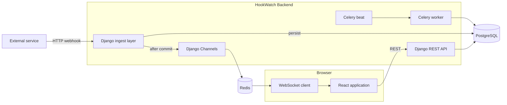
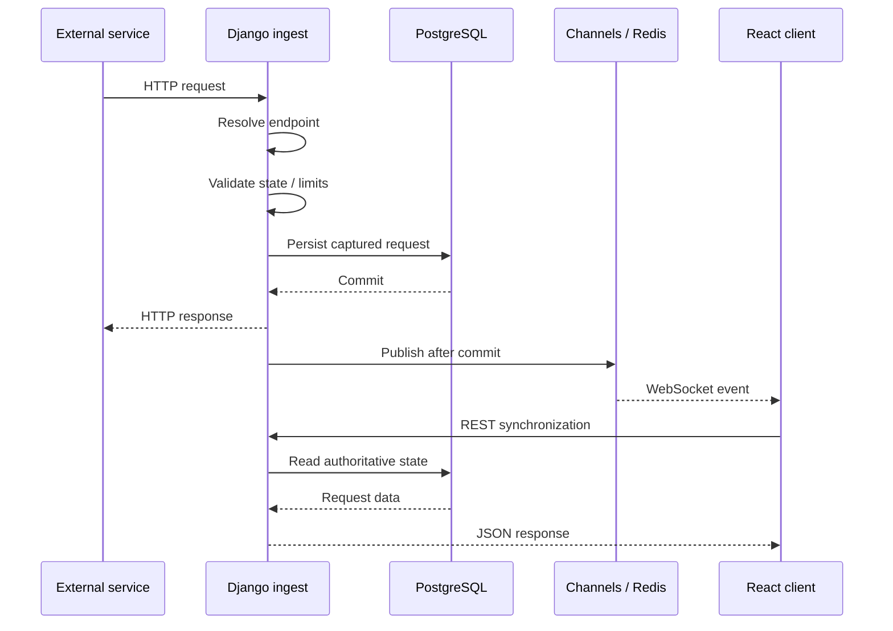
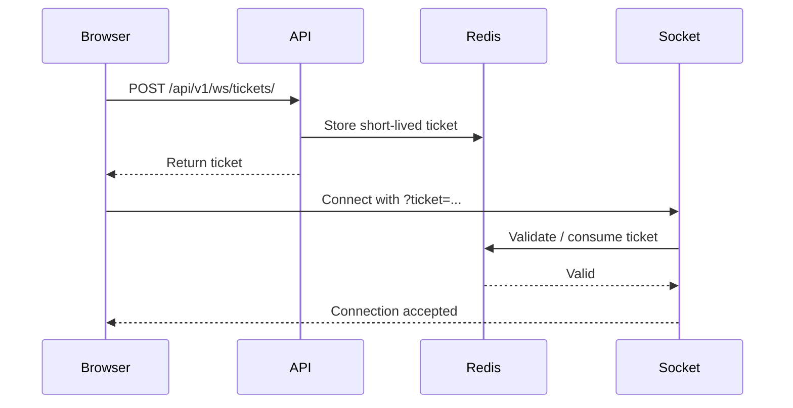
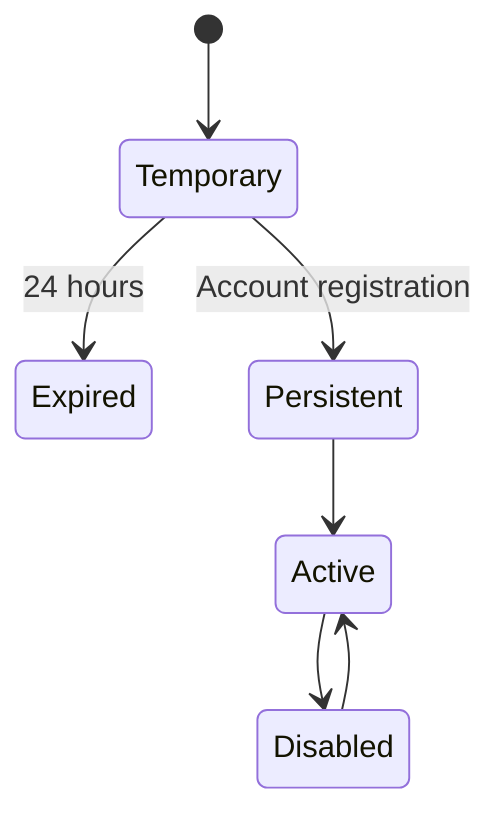
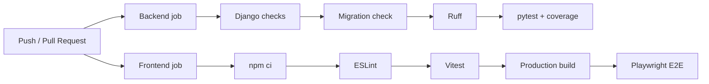
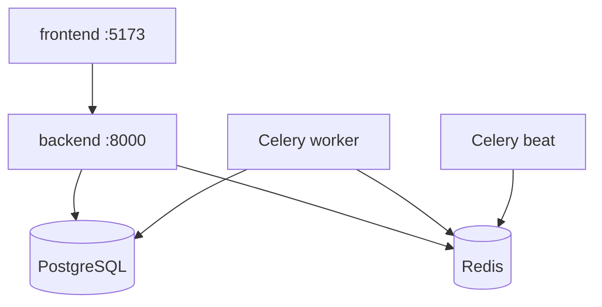

<div align="center">

# HookWatch Architecture

### Design and technical architecture of the real-time webhook inspector

HookWatch is built around a simple invariant:

> **Persist first. Notify second.**

PostgreSQL owns the authoritative application state.  
Realtime infrastructure improves the user experience but never replaces persisted data.

</div>

---

## System overview



<div align="center">

| Layer | Responsibility |
| --- | --- |
| React | User interface and developer workflow |
| Django REST Framework | Authoritative HTTP API |
| Django ingest layer | Fast webhook capture |
| PostgreSQL | Persistent source of truth |
| Django Channels | Realtime event delivery |
| Redis | Channels, tickets, rate limiting and Celery infrastructure |
| Celery | Background work |
| Celery Beat | Periodic scheduling |

</div>

---

## Core architectural principle

HookWatch deliberately separates **persistence** from **realtime delivery**.

A captured webhook is only considered authoritative once it has been stored in PostgreSQL.

WebSocket messages are therefore notifications that state has changed.

They are not the state itself.

This means the application can recover from situations such as:

```text
WebSocket disconnects
lost realtime messages
browser suspension
temporary Redis failures
network changes
client reconnects
```

After reconnecting, the frontend can synchronize again through the REST API.

---

## Webhook request lifecycle



The critical path is intentionally kept short.

The ingest layer is responsible for safely receiving and persisting the webhook with as little non-essential work as possible.

Realtime publication happens only after the database transaction has successfully committed.

---

## Webhook ingestion

HookWatch accepts requests through:

```text
/hooks/{ingest-token}/
```

and nested paths:

```text
/hooks/{ingest-token}/{nested-path}
```

For example:

```text
/hooks/abc123/github/push
/hooks/abc123/stripe/events
/hooks/abc123/internal/builds/42
```

The nested path is preserved as part of the captured request.

During ingestion, HookWatch performs the following operations:

<table>
<tr>
<td width="50%" valign="top">

### Validation

- Resolve ingest token
- Verify endpoint state
- Detect expired temporary endpoints
- Enforce body-size limits
- Apply ingest rate limiting

</td>

<td width="50%" valign="top">

### Capture

- HTTP method
- Request path
- Headers
- Query parameters
- Content-Type
- Raw body
- Parsed JSON when possible
- Body size
- Source IP
- Timestamp

</td>
</tr>
</table>

---

## Persistence model

### Endpoint

An endpoint represents a webhook destination.

Conceptually it contains:

```text
UUID
owner
display name
ingest token
management-token hash
temporary state
enabled / disabled state
expiration timestamp
created timestamp
updated timestamp
```

Persistent endpoints belong to an authenticated user.

Temporary endpoints have no owner.

Database constraints enforce that temporary and persistent endpoint states remain internally consistent.

---

### Captured request

Each incoming webhook is stored independently.

```text
UUID
endpoint
HTTP method
path
headers
query parameters
content type
raw body
parsed JSON
body size
source IP
received timestamp
```

The raw body and parsed representation are intentionally separate.

This allows HookWatch to provide a structured JSON viewer while still preserving the exact original body received from the sender.

---

## PostgreSQL

<div align="center">

### PostgreSQL is the source of truth

</div>

PostgreSQL stores persistent application state including:

```text
users
endpoints
captured requests
authentication-related state
```

Captured requests are indexed around the workspace's primary access patterns.

Important indexes include:

```text
endpoint + received timestamp
endpoint + HTTP method
```

This supports chronological browsing and method-based filtering efficiently.

If PostgreSQL cannot persist a webhook, HookWatch treats the capture as failed.

---

## Realtime architecture

Realtime functionality is implemented using:

```text
Django Channels
Redis
WebSockets
```

The browser subscribes to a specific endpoint.

Realtime messages can represent changes such as:

```text
new request captured
request deleted
request history cleared
endpoint lifecycle change
```

The frontend uses these messages to synchronize TanStack Query state.

It does not use the WebSocket as a second client-side database.

---

## WebSocket authentication

HookWatch does not expose normal long-lived authentication credentials directly in WebSocket URLs.

Instead, it uses short-lived WebSocket tickets.



The connection URL follows the form:

```text
/ws/endpoints/{endpoint-id}/?ticket=...
```

Tickets are:

```text
short lived
endpoint scoped
stored in Redis
single-purpose
```

On reconnect, the browser requests a new ticket.

---

## Redis

Redis provides infrastructure for several independent concerns:

<table>
<tr>
<td valign="top">

### Realtime

Django Channels uses Redis to distribute WebSocket events.

</td>

<td valign="top">

### WebSocket tickets

Temporary connection tickets are stored and validated through Redis.

</td>
</tr>

<tr>
<td valign="top">

### Rate limiting

Webhook ingestion uses Redis-backed rate limiting.

</td>

<td valign="top">

### Background jobs

Redis supports Celery infrastructure.

</td>
</tr>
</table>

Redis is intentionally **not** used as the persistent request database.

Where safe, Redis failures are treated as degraded infrastructure rather than a reason to invalidate a webhook that has already been committed to PostgreSQL.

---

## Authentication

HookWatch uses JWT authentication with different storage strategies for access and refresh credentials.

### Access token

The frontend keeps the access token in application memory.

It is not persisted in:

```text
localStorage
sessionStorage
```

### Refresh token

The refresh token is stored inside an HttpOnly cookie.

The cookie is scoped to:

```text
/api/v1/auth/
```

The backend handles:

```text
registration
login
refresh
rotation
logout
blacklisting
```

This prevents frontend JavaScript from directly reading the long-lived refresh credential.

---

## Anonymous endpoints

HookWatch allows a user to start using the product before registration.

A temporary endpoint:

```text
has no authenticated owner
expires after 24 hours
has an ingest token
has a separate management token
```

The ingest token identifies where requests should be delivered.

The management token grants access to inspect and manage the temporary endpoint.

These credentials are deliberately different.

Possessing an ingest URL therefore does not automatically grant management access.

Only a hash of the management token is persisted by the backend.

---

## Endpoint adoption

A temporary endpoint can become permanent when the user registers.



During adoption, the backend validates the temporary endpoint and its management token.

On success:

```text
owner is assigned
temporary flag is removed
expiration is removed
management-token hash is removed
captured request history remains attached
```

The user therefore keeps all requests captured before registration.

---

## Frontend architecture

The frontend is built with React and TypeScript.

<div align="center">

| Concern | Tool |
| --- | --- |
| Server state | TanStack Query |
| Routing | React Router |
| Forms | React Hook Form |
| Validation | Zod |
| Internationalization | i18next |
| Styling | Tailwind CSS |
| Unit / component tests | Vitest + React Testing Library |
| E2E | Playwright |

</div>

TanStack Query owns server-derived state.

HookWatch intentionally avoids maintaining a second global state store containing copies of API data.

Local React state is used for UI-only concerns such as:

```text
selected inspector tab
search filters
command palette
test sender
focus mode
dialogs
```

The selected request is also reflected in URL query parameters where appropriate.

---

## Request inspector

The inspector is divided into five main views.

<table>
<tr>
<th>Tab</th>
<th>Purpose</th>
</tr>

<tr>
<td><strong>Overview</strong></td>
<td>Method, timestamp, content type, size, source IP and request ID</td>
</tr>

<tr>
<td><strong>Headers</strong></td>
<td>Original HTTP request headers</td>
</tr>

<tr>
<td><strong>Body</strong></td>
<td>Structured JSON when available, otherwise body text</td>
</tr>

<tr>
<td><strong>Query</strong></td>
<td>Query parameters including multi-value parameters</td>
</tr>

<tr>
<td><strong>Raw</strong></td>
<td>Original captured request body</td>
</tr>
</table>

---

## Internationalization

HookWatch currently supports:

```text
English
Spanish
```

English is the fallback language.

The selected interface language is persisted in the browser.

Internationalization only applies to application UI.

Captured HTTP data remains untouched.

This includes:

```text
HTTP methods
header names
URLs
JSON keys
JSON values
event names
request paths
endpoint names
raw request bodies
```

The inspector therefore always represents the request as it was originally received.

---

## Celery and background jobs

Celery handles work that does not belong in the HTTP ingestion critical path.

HookWatch runs:

```text
Celery worker
Celery Beat
```

The current recurring lifecycle includes cleanup of expired temporary endpoints.

Separating periodic work from normal HTTP requests keeps webhook ingestion focused on capture.

---

## Rate limiting

Webhook ingestion includes Redis-backed rate limiting.

The development defaults are:

```text
HOOKWATCH_INGEST_RATE_LIMIT=120
HOOKWATCH_INGEST_RATE_WINDOW_SECONDS=60
```

The limiter is designed to degrade safely if Redis becomes unavailable rather than turning rate limiting into a hard dependency for already-valid ingest traffic.

---

## Request body protection

Captured bodies have a configurable maximum size.

The default development value is:

```text
HOOKWATCH_MAX_BODY_SIZE=1048576
```

Equivalent to:

```text
1 MiB
```

This protects both memory usage and persistent storage from unexpectedly large payloads.

---

## Source IP handling

Forwarded IP headers are not trusted blindly.

HookWatch allows trusted proxy networks to be explicitly configured.

```text
HOOKWATCH_TRUSTED_PROXY_NETWORKS=
```

When the application is not operating behind a trusted proxy, arbitrary forwarded headers are not treated as authoritative source addresses.

---

## Health checks

HookWatch exposes:

```text
GET /api/v1/health/
GET /api/v1/health/live/
GET /api/v1/health/ready/
```

Docker Compose uses service health checks to coordinate startup.

PostgreSQL and Redis expose their own container health checks, while the backend readiness endpoint is used to determine whether the application is ready to serve dependent services.

---

## Failure model

<table>
<tr>
<th>Failure</th>
<th>Expected behaviour</th>
</tr>

<tr>
<td><strong>PostgreSQL unavailable</strong></td>
<td>The webhook cannot be safely captured and the operation fails.</td>
</tr>

<tr>
<td><strong>Redis unavailable</strong></td>
<td>Realtime, rate limiting or WebSocket-ticket functionality may degrade depending on the operation.</td>
</tr>

<tr>
<td><strong>WebSocket disconnected</strong></td>
<td>The REST API remains authoritative and the frontend can recover state.</td>
</tr>

<tr>
<td><strong>Realtime publish fails after DB commit</strong></td>
<td>The persisted request remains valid and can be retrieved through REST.</td>
</tr>
</table>

---

## Security boundaries

HookWatch deliberately separates several credentials and trust boundaries.

<table>
<tr>
<td><strong>Ingest token</strong></td>
<td>Identifies a webhook destination.</td>
</tr>

<tr>
<td><strong>Management token</strong></td>
<td>Controls access to temporary endpoints.</td>
</tr>

<tr>
<td><strong>Access JWT</strong></td>
<td>Short-lived authenticated API access.</td>
</tr>

<tr>
<td><strong>Refresh JWT</strong></td>
<td>Longer-lived credential stored in an HttpOnly cookie.</td>
</tr>

<tr>
<td><strong>WebSocket ticket</strong></td>
<td>Short-lived endpoint-specific realtime connection credential.</td>
</tr>
</table>

Additional protections include:

```text
management-token hashing
refresh-token blacklisting
WebSocket origin validation
request-size limits
rate limiting
trusted proxy configuration
non-revealing authorization failures
```

---

## Testing strategy

### Backend

```text
Django system checks
migration checks
Ruff
pytest
pytest-cov
```

Backend tests cover areas including authentication, endpoint management, webhook ingestion, request lifecycle, realtime infrastructure and resilience.

### Frontend

```text
ESLint
Vitest
React Testing Library
TypeScript build
Playwright
```

### CI



Backend and frontend quality gates run independently through GitHub Actions.

---

## Docker topology



The local stack is orchestrated through Docker Compose.

---

## Design decisions

<div align="center">

<table>
<tr>
<th>Decision</th>
<th>Reason</th>
</tr>

<tr>
<td><strong>PostgreSQL as source of truth</strong></td>
<td>Captured webhook data must survive realtime or client failures.</td>
</tr>

<tr>
<td><strong>WebSockets for notifications</strong></td>
<td>Realtime UX without coupling state correctness to socket delivery.</td>
</tr>

<tr>
<td><strong>Short-lived WS tickets</strong></td>
<td>Avoid exposing normal long-lived JWT credentials in WebSocket URLs.</td>
</tr>

<tr>
<td><strong>Separate ingest and management tokens</strong></td>
<td>Receiving requests should not imply permission to inspect them.</td>
</tr>

<tr>
<td><strong>Access JWT only in memory</strong></td>
<td>Avoid persistent JavaScript-readable access-token storage.</td>
</tr>

<tr>
<td><strong>Raw + parsed request body</strong></td>
<td>Provide structured inspection without losing original input.</td>
</tr>

<tr>
<td><strong>TanStack Query for server state</strong></td>
<td>Avoid duplicating authoritative API state in another global store.</td>
</tr>

<tr>
<td><strong>Docker Compose development</strong></td>
<td>Keep PostgreSQL, Redis, Celery and application services reproducible.</td>
</tr>
</table>

</div>

---

## Current boundaries

HookWatch is currently a **webhook capture and inspection tool**.

It deliberately does not yet implement:

```text
request forwarding
automatic replay
request transformations
team workspaces
OAuth integrations
provider-specific SDKs
CLI tools
hosted billing
```

These features can be layered onto the current architecture without changing the fundamental persistence-first design.

---

<div align="center">

## Architecture summary

**External request → persist → notify → inspect**

PostgreSQL keeps the truth.

Redis enables realtime infrastructure.

REST provides synchronization.

WebSockets provide immediacy.

Celery handles background work.

</div>